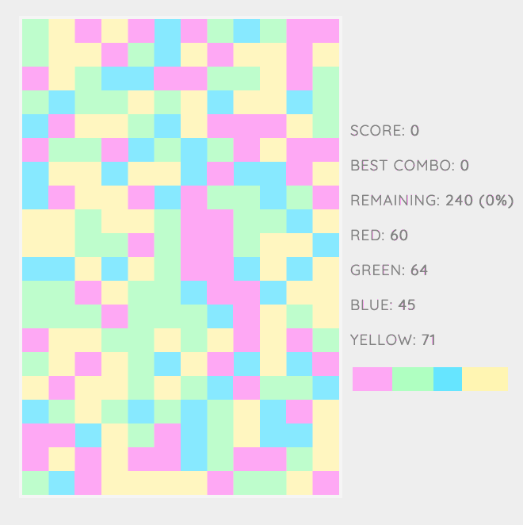

# K U B

Demo: [https://kub.sandbox.nboisvert.com](https://kub.sandbox.nboisvert.com)

## What is KUB?

KUB is a block game. Your target is to be able to remove all cells from the grid. Select zones of the same color to remove the zone, unique cell cannot be removed. The first screen you see wants you to input a seed value.

## A seed?

In the world of the randomness, "seeds" are used to generate random values, for a given seed, the same value will be generated every time. This means that if you play on seed `1`, you will always have the same grid setup each time you start a game. Using `2` will generate a new grid.

## Purpose of the game

The main usage of KUB was learning purposes. I wanted a relaxing block falling game I could write on my own to get used to the Elm programming language.

## Try it!

Try it here [https://kub.sandbox.nboisvert.com](https://kub.sandbox.nboisvert.com), don't hesitate to tag me @_nboisvert on Twitter if complete a seed with you best combo!
